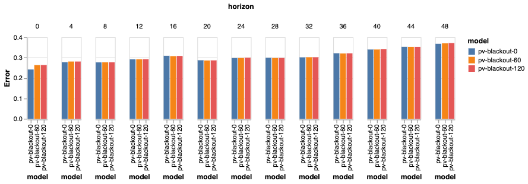
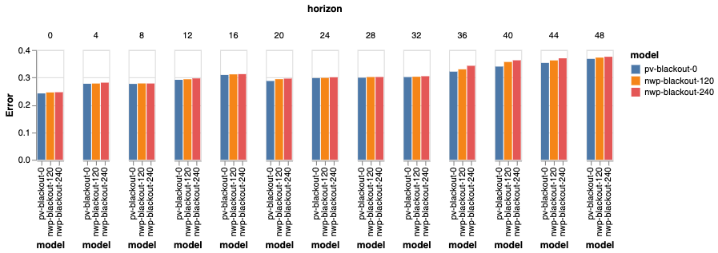
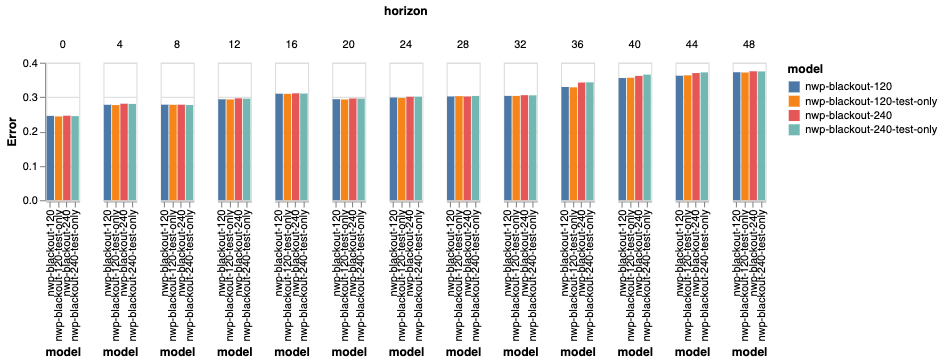
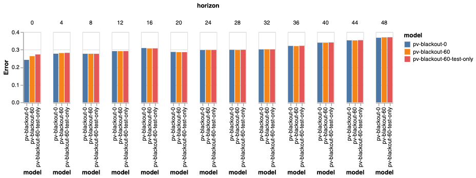

# Effect of blackout

*Note that since we made those experiments, the term "blackout" has been changed to "lag" throughout the code.*

## Context

By "blackout" we mean the time period before the data is available.
In those experiments we assume that this is fixed (in practice the delay might vary).

When working with times series, it's easy to forget about this and assume that at time $t_0$, everything before is available.
Once in production, however, there is often a delay $\delta t$ before the data is available.
This means that the model can get confused.

In these experiments we try to quantify the effects of having that kind of blackout on PV and NWP
data, on the `uk_pv` dataset.

## Experiment1: blackout on PV

### Methodology

Blackout of 0, 60 and 120 minutes on the PV Data.
The same blackout is used both in training and testing.

### Results

### Analysis

Difference is very small and only for very short horizons.
Not much difference between 60 and 120 minutes, maybe because our features on recent history are using the last 60 minutes of data.
We should adjust that window to whatever blackout we have in production.

## Experiment2: blackout on NWP

### Methodology

Blackout of 0, 120, 240 minutes on NWP data.
Again same blackout in train and test.

### Results

## Experiment 3: No blackout in train but NWP blackout in test

This is to simulate what happens when we don't take into account the blackout period when training,
but when we should have!

### Methodology

No blackout during training.
No PV blackout since typically that data is available fast.
Blackout of 120, 240 minutes for NWP at test time.

### Results

We compare training with the same blackout to training with no blackout.

### Analysis

"Forgetting" about NWP blackouts at train time has a surprisingly small effect!
This might be due to the fact that the patterns learned by the model are similar even if the
NWP prediction is less accurate, which intuitively makes sense. 

## Experiment 4: No blackout in train but PV blackout in test

### Methodology

No blackout during training.
No blackout for NWP.
PV blackout of 60 minutes at test time.

### Results

### Analysis

In this case, not forgetting about the blackout, at train-time, does help.
I think this is because the features computed from PV data during the blackout (last 60 minutes)
are useful for short horizons and so the model learns to leverage them.
When the blackout is introduced at test-time, the model does whatever it did when the value was
missing at train-time, which seems to not be optimal.

## Conclusion

As we can expect, the bigger the blackout, the bigger the effect.
The effect is different depending on the horizon.

Taking into account the expected blackout while training helps in cases where the model learns
different pattern depending if the (blackout) data is present or not. This is the case for recent PV
data for short horizons, but it is less the case for NWP data.
