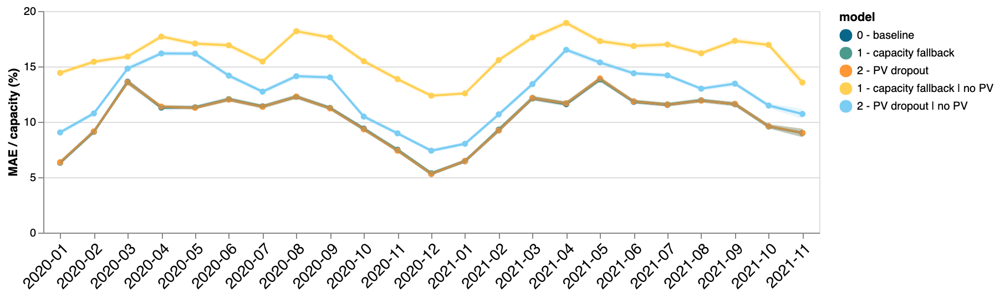
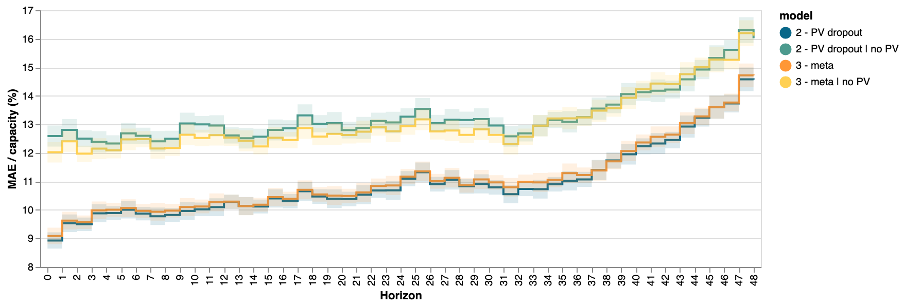
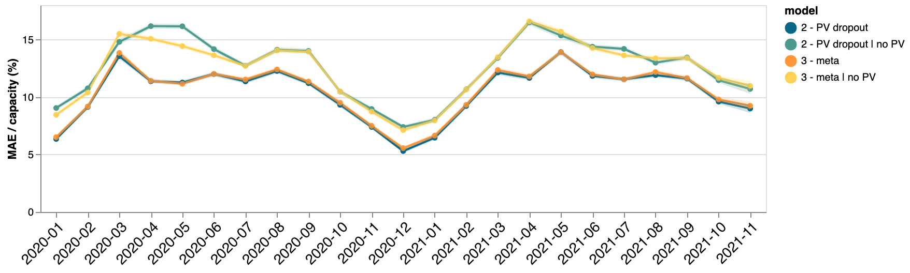

# No PV history at inference time

Our goal is to have our model do something reasonable when there is no PV history.

The idea will be to randomly dropout PV history when training, to make the model
somewhat robust to missing PV data. We will try to compensate the missing data with
metadata.

All the experiments are done on the `uk_pv` data with the (often unreliable!) associated metadata.

## Experiment 1: Dealing with capacity

### Motivation
We typically use quantile(0.99) of the previous week or so of the PV data as capacity,
and we normalize PV output by that value. If no PV data is available, then it breaks
this normalization scheme. What we'll do here is try to fallback on the capacity from
the metadata instead.

### Methodology
We train these models
0. Baseline model which what we had before
1. Train a model where we fall back on the metadata capacity when there is no history
   (there shouldn't be much change since that's rare in the data)
2. Train the same model with random PV dropout (10% of the time we set all the PV
   history to NaN, and thus use the capacity from the metadata)

We test 0,1,2 on our usual data (which include PV history except where there are rare
holes in the data). Then we test 1 and 2 on the same data but where we remove the PV
history.

For all these experiments we set orientation=180 and titl=35 for all the PVs (this is
also used for the normalization)

### Results

### Discussion

* Adding a fallback on metadata for capacity doesn't hurt the performance on the regular
    test set
* Adding 10% PV dropout doesn't hurt the performance on the regular test set
* Adding those (capacity fallback and PV dropout) helps when PV data is missing

### Conclusion

We can fallback on metadata for capacity, train with a bit of PV dropout, and we'll
improve our accuracy on PVs without history in production. That without losing accuracy
on PVs with history.

## Experiment 2 - Using tilt and orientation from metadata and falling back on 35/180 only if they are missing.

### Motivation

Previously we used tilt=35 and orientation=180 (used for normalization) and basically let the PV history
compensate for the wrong tilt and orientation. This has also been motivated by the fact
that we don't trust the metadata very much in general.

Since we want to do something reasonable when the PV history is missing, perhaps we can use the right
metadata instead. The PV history could still compensate when it's wrong, but hopefully
when there is no history, the metadata will be more accurate!

### Methodology
We train a new model that uses the tilt and orientation on the metadata and we evaluate
it both on test data with and without PV history. We compare it with model 2 from the
previous experiment (with capacity fallback and PV dropout).

### Results

Mean:  MAE / capacity (%)
2 - PV dropout: 10.95 ± 0.04
2 - PV dropout | no PV: 13.28 ± 0.05
3 - meta: 11.06 ± 0.04
3 - meta | no PV: 13.07 ± 0.05
Yesterday baseline: 16.60 ± 0.06 (Ran separately: this is why it's not in the charts)

### Discussion

Using the tilt/orientation from the metadata hurts a little when PV data is
available, and helps a little when PV data is missing.
