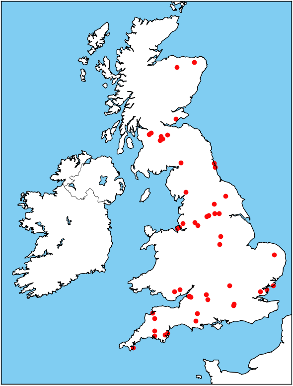
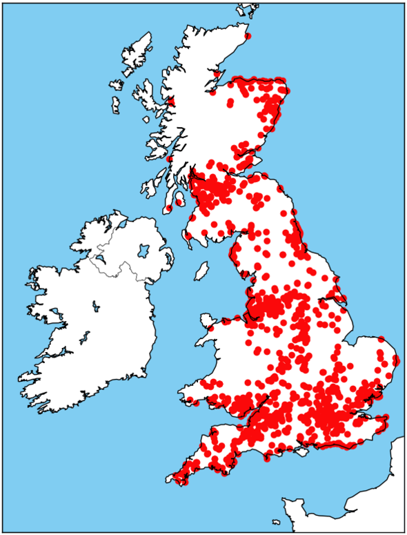
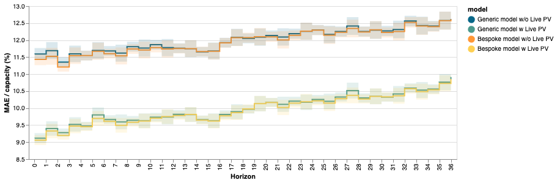
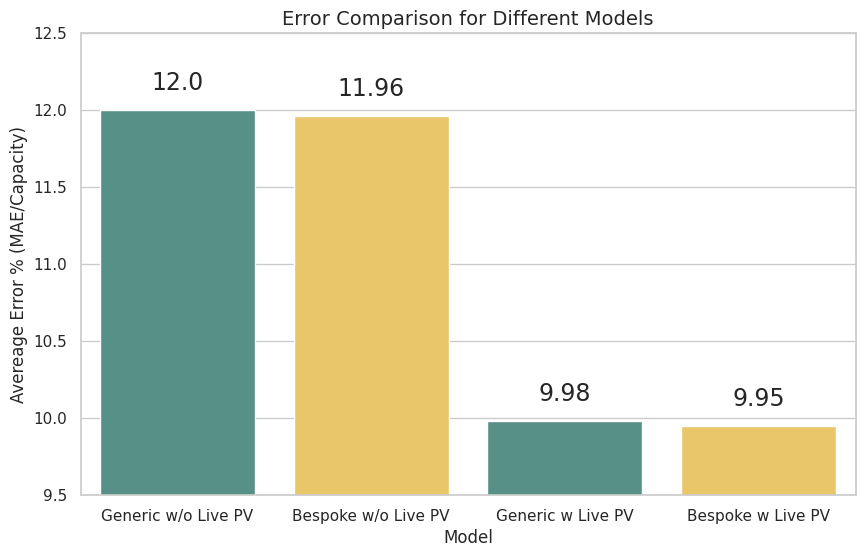
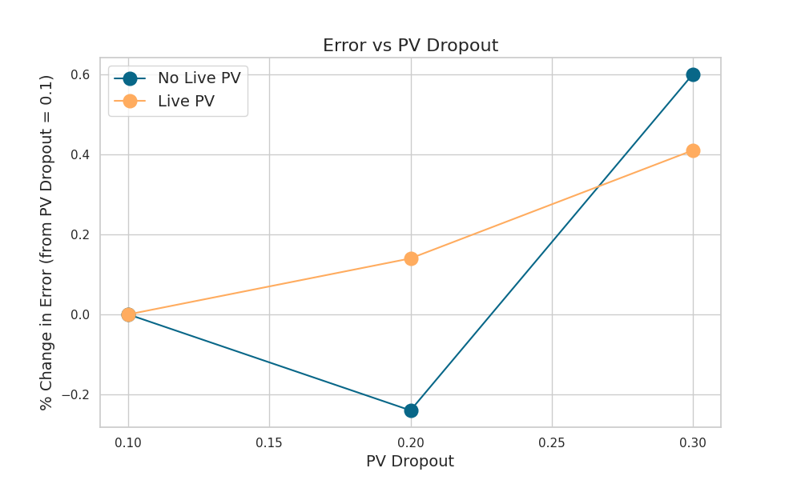

# Generic vs Bespoke Models With and Without Live PV

This experiment has quantified the difference between using a "generic model" versus a "bespoke model" when forecasting for a specific set of sites. A test set of 50 household sites in the UK (with capacities less than 4kW) has been created to do this. A bespoke model is trained using just these 50 sites where as the generic model has been trained off data from over 1000 sites (with the test set sites removed).


| Test Set Sites | Generic Set Sites |
|--------------|-----------------|
|  |  |


For the case of using a generic model to forecast the test set a different "eval-config" can be set when running inference to use the test set sites data.

```bash
poetry run python psp/scripts/eval_model.py -n uk_generic_model --eval-config psp.exp_configs.uk_pv_testset --new-exp-name uk_generic_model_on_testset
```

Live power generation data from solar panels is a useful feature for the model however, there are cases where the effort and costs involved with obtaining live PV data is not worth the improvement in error.

To simulate conditions without live PV data during evaluation, the --no-live-pv flag can be used when running evaluation. This removes certain features that are generated from live pv data from being used during inference. For example:

```bash
poetry run python psp/scripts/eval_model.py -n uk_pv --no-live-pv
```

Evaluation was performed on 20,000 samples between the dates of 2021-01-01 to 2021-11-08 with multiple NWP sources used for inputs. 4096 samples were used for training. 


*Figure 1: Comparison of error (MAE/Capacity) between generic and bespoke models with and without live PV data.*

In both cases the bespoke model and generic model perform very similarly, with around a 0.3% difference between the generic and bespoke model for both live PV and no Live PV cases.

There does appear to be a slightly stroger difference in 0-8 hours horizon forecasts for the no live pv cases between the generic and bespoke model.

| Exp name | Generic Model | Bespoke Model | Live PV | Error (MAE/Capacity) % |
|-----------|:-----:|:---------:|:-----------:|:-----:|
| Generic model w/o Live PV | x |  | | 12.00 |
| Generic model w Live PV | x | | x | 9.98 |
| Bespoke model w/o Live PV | | x | | 11.96|
| Bespoke model w Live PV | | x | x | 9.95 |



*Figure 2: Bar chart comparison of error (MAE/Capacity) between generic and bespoke models with and without live PV data.*

For sites or situations where there is limited pv data a combination of generic pv data and site specific data may be beneificial. As the testset contain data from 50 sites it still provides a set of diverse weather conditions from all across the UK.

With enough PV samples a bespoke model seems to have slighty better performance to that of that of the generic model. This test was first ran training off just 500 samples which showed the generic model to be slightly better.


# Effects of increasing PV dropout for metadata only models

A pv dropout of 0.1 has been used for the experiment above. This is equivlent to 10% of the samples which is ~4000 so around 400 samples have the live pv data set to NaN.

Training using a PV dropout of 0.1, 0.2 and 0.3 have been explored to see if there are any significant changes in the error.


*Figure 2: Change in error relative to where pv dropout is equal to 0.1, training with 4096 samples.*

There is a very small change in error. Changing the dropout to 0.2 (around 800 samples) has a slight increase in the error for the case without live pv and slight decrease in error for the case with live pv. With a pv droupout of 0.3 both cases see a decrease in error.
