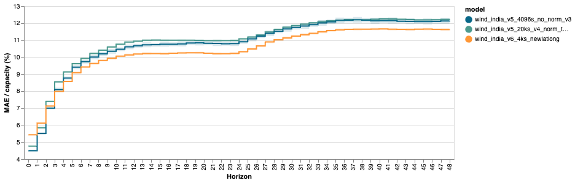

# Forecasting Wind

Adapating the pv-site model to be able to forecast wind.

Make sure that the `normalize_features` parameter in the config is set to `False`. This is as if set to true, the pv data would be normalised by the irradiance on the place of array.

Also need to set `normalize_targets` to false, also set in the config.

In the `decsion_trees.py` there are also other modifications to account for wind around capacity normalisation.

Currently the site model takes only single spaital forecast of NWPs. The latitude and longitude was chosen based on research around the which point it India most correlates to the expected generation.

The `wind_india.py` has been used.

The final error is 10.43 % (MAE/Capacity).

